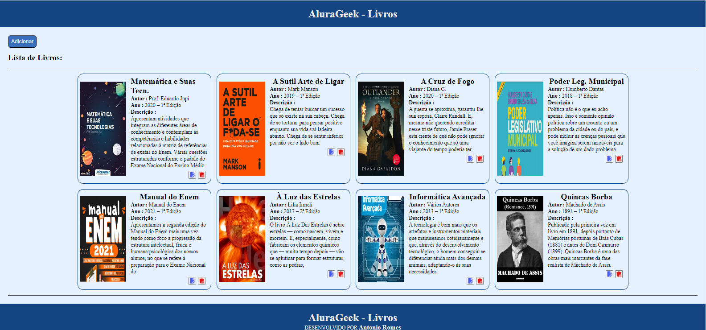
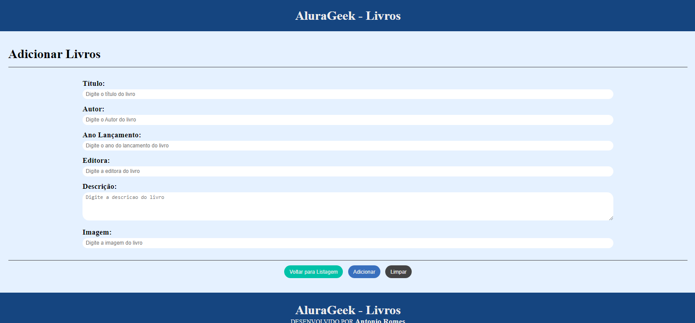
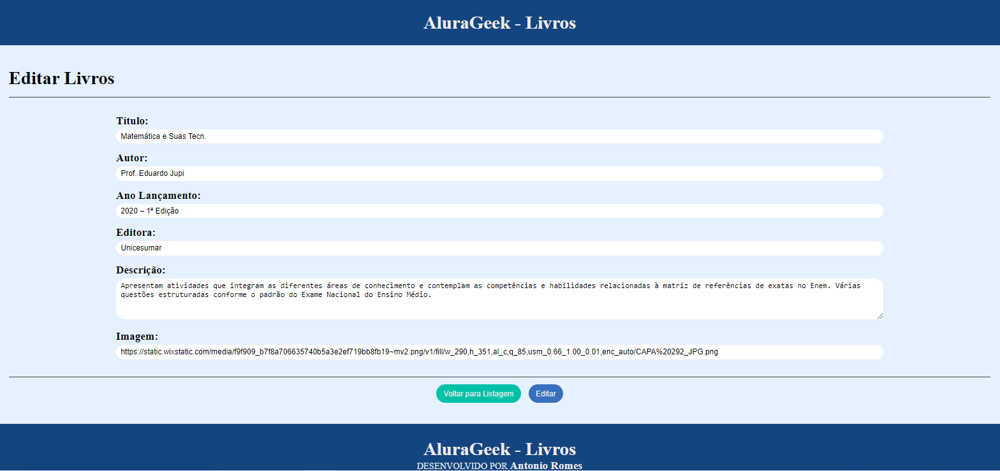
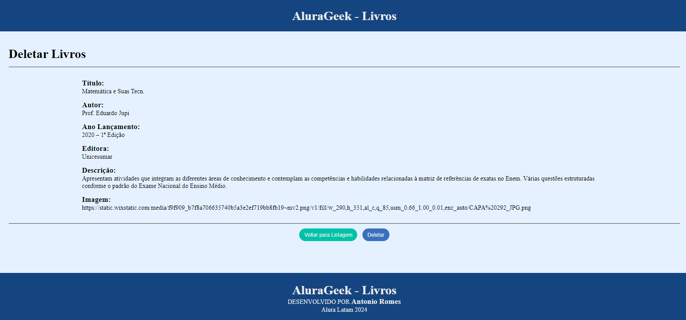

 
# AluraGeek - Livros 
[](https://github.com/devsuperior/sds1-wmazoni/blob/master/LICENSE) 

# Sobre o projeto

 AluraGeek - Livros
 

## Layout  
    
 

# Tecnologias utilizadas 
## Front end
- HTML / CSS / JS  
 

# Como executar o projeto

## Back end
Pré-requisitos: Java 11

```bash
# clonar repositório
git clone https://github.com/devsuperior/sds1-wmazoni

# entrar na pasta do projeto back end
cd backend

# executar o projeto
./mvnw spring-boot:run
```

## Front end web
Pré-requisitos: npm / yarn

```bash
# clonar repositório
git clone https://github.com/devsuperior/sds1-wmazoni

# entrar na pasta do projeto front end web
cd front-web

# instalar dependências
yarn install

# executar o projeto
yarn start
```

# Autor

Antonio Romes 

https://www.linkedin.com/in/antonio-romes/

